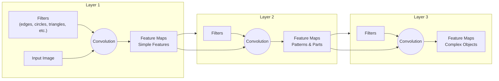

# M1: Simple introduction to machine learning

Machine learning has been around for multiple decades, but it has gained attention as deep learning models have surpassed human accuracy in the ImageNet Challenge. Convolutional Neural Networks (Deep learning) have been used since 2012.

How do we teach a machine to learn?

`DATA -> Machine -> Model -> Prediction`

A machine can learn a predictive model based on labeled data.

##Logistic regression

We need a training set so the algorithm can infer what parameters are consistent with the training data.

A simple logistic regression can be represented as $p(y_i = 1 \mid x_i)$.

Logistic regression is a specific type of Generalized Linear Model (GLM).

```
Generalized Linear Models (GLMs)
│
├── Linear regression
├── Logistic regression
├── Poisson regression
├── Gamma regression
└── ...
```

**Logistic regression** is one of the simplest and most widely used machine learning algorithms for **binary classification** problems.

Given an input feature vector $\mathbf{x}$ and a parameter (weight) vector $\mathbf{\beta}$, the model first computes their **inner product** (also called the **dot product**):

$$
z = \mathbf{x}^\top \mathbf{\beta}
= \beta_0 + \beta_1x_1 + \beta_2x_2 + \cdots + \beta_nx_n
$$

Each feature $x_i$ is multiplied by its corresponding parameter (weight) $\beta_i$, and the results are summed together.

The parameter vector $\mathbf{\beta}$ can be thought of as a **filter** that determines how important each feature is in making a prediction.

- Large positive weights increase the prediction.
- Large negative weights decrease the prediction.
- Weights close to zero contribute very little.

In other words, logistic regression computes the **inner product between the data vector and the weight vector**, which measures how well the input aligns with the learned parameters.

The resulting value $z$ is then passed through the **sigmoid function** to convert it into a probability between 0 and 1:

$$
p(y=1 \mid \mathbf{x}) = \frac{1}{1 + e^{-z}}
$$

where

$$
z = \mathbf{x}^\top \mathbf{\beta}.
$$

> Sigmoid function: It converts a real-valued number to a probability of a positive outcome.


## Multilayer Perceptron

A basic form of neural networks/deep learning. Logistic regression is only effective when a linear classifier can easily distinguish between class 1 and 0. 

Multilayer preceptron can be viewed as a logistic regression on K latent features, rather than directly on the M components of raw data. It is simply extending the use of logistic regression to add additional layer of intermediate filters. This allows for non-linear classification of datasets.

z_ik = b_0k + x_i * b_K

> Logistic regression maps the feature vector to a single  real-valued number, while multilayer perceptron maps the feature vector  to multiple real-valued numbers.
> latent processes = filter
> Map K latent feature probabilities through a logistic regression.

Deep as in has multiple layers of latency processses. 

**Model selection**

Bias Variance Trade-Off:  

> Given different sets of training data, in which model would you expect more variance in the learned parameters?
> - Multilayer perceptron

softmax?
    
## Convolutional Neural Networks

- Convolutional neural network (CNN) is used for **analyzing images**
- It breaks the image down into different hierarchial motif compositions- Understanding Image Composition:
  - Images are composed of high-level motifs that appear in different locations within each image.
    - These motifs represent repeated structures such as edges, corners, textures, and shapes common in natural images.
  - Hierarchical Structure of Images
    - Each motif is made up of smaller repeated sub-motifs, which themselves consist of basic atomic elements or fundamental shapes.This hierarchical, multi-layered structure reflects the deep architecture of CNNs, capturing image features at various levels of abstraction.
  
    > Layer 1: Atomic elements
  
    > Layer 2: Sub-motifs
  
    > Layer 3: Motifs
  
    > Atomic elements -> Sub-motifs -> Motifs

  - Motivation for Deep Convolutional Neural Networks
    - The goal is to build models that can capture this hierarchical representation of images.
    - CNNs leverage the repeated and shifted nature of motifs and sub-motifs to analyze images effectively, often surpassing human performance in image recognition tasks.
  
**Convolution Filters**

Convolutional neural networks (CNNs) identifies hierarchical patterns in images by using convolution operations with filters at multiple layers.

- Convolution with Atomic Elements
  - Atomic elements (basic shapes like triangles) are used as filters that are *shifted* across the image to compute correlations, producing **feature maps** that highlight where these elements appear (high correlation shows up in red for example).
  - The process of shifting filters over the image to detect local matches is called **convolution**, which forms the basis of CNNs. (how much the atomic element macthes with the local element)
- Building Sub-Motifs from Atomic Elements
  - Sub-motifs are combinations of atomic elements, detected by convolving filters designed to recognize these combinations with the feature maps from the atomic element layer.
  - Each sub-motif corresponds to a pattern of strong activations in the feature maps of its constituent atomic elements.
- Hierarchical Detection of Motifs
  - Higher-level motifs are composed of multiple sub-motifs, detected by convolving filters at the next layer with the sub-motif feature maps.This hierarchical convolution process continues up the layers, producing feature maps that indicate the presence and location of complex motifs in the image.
  - The highest layer feature map allows classification.
  


**Convolutional Neural Network (CNN) Math Model**

- Convolutional Neural Network Structure

  - CNNs analyze many images by applying **filters** (**parameters**) across each image to create feature maps that highlight important patterns.

  - Filters at each layer are *learned* parameters representing pixel values, not predefined shapes, and are convolved with feature maps from the previous layer.

- Layered Feature Extraction

  - The first layer applies filters to the input image to produce initial feature maps.
  - Subsequent layers apply their own filters to the feature maps from the previous layer, *progressively extracting higher-level features.*

- Classification from Features

  - The top layer produces a final feature map used by a **classifier** to *assign a label to the image.*
  - The classifier, parameterized by weights, can be a logistic regression or multilayer perceptron, trained to predict the image label based on extracted features.
  
**How does the model learn exactly?**

*Parameter estimation to minimize prediction error.*

- Model Parameters and Data

  - The CNN model has parameters represented by filters at multiple layers:

    $$
    \Phi,\ \Psi,\ \Omega,\ \mathbf{W}
    $$
  
  - Learning assumes access to a large labeled dataset consisting of image-label pairs:

    $$
    \{(I_n, y_n)\}_{n=1}^{N}
    $$

    where

    - Iₙ = the n-th input image
    - yₙ ∈ {+1, −1} = binary class label

- **Loss Function** and Learning Objective

  - An energy function *E* measures the loss between the true label yₙ and the predicted label Iₙ from the model.
  - The goal of learning is to find parameters that minimize the total loss over all training examples.

- Challenges in Learning

  - The parameter space is very high-dimensional, often with millions of parameters, making optimization difficult.
  - The loss landscape has many local minima, complicating the search for the global optimum.
  - Decades of research have been required to develop effective methods for this challenging optimization problem.

**Advantage of Hierarchial Elements**

- Learning is manifested by taking large quantities of labeled data.
- Learning is a concept of estimating the model parameteres so the predictions are conistent with true labels.
  
    
## Applications in the Real World

- Performance of Deep CNNs on ImageNet

  - Deep CNNs, combined with GPUs and massive datasets like ImageNet (1.2 million images across 1,000 classes), significantly improved image classification accuracy starting around 2013.
  - By 2017, these models surpassed human-level performance in classifying complex, realistic images.

- Applications and Breakthroughs

  - The models output probabilities for multiple classes per image, demonstrating impressive accuracy in labeling diverse images.
  - A notable milestone was DeepMind's use of deep CNNs with reinforcement learning to defeat top human players in the complex game of Go, previously thought unbeatable by machines.

- Advanced Uses of Deep CNN Features

  - Beyond classification, CNN features have been used in natural language processing to generate high-quality, grammatically correct captions describing images.
  - This integration of image analysis and text synthesis showcases the sophistication and versatility of modern deep learning architectures.

**Deep Learning and Transfer Learning**

convolutional neural networks (CNNs), in medical image analysis and the concept of transfer learning.


- Applications of Deep Learning in Medicine

  - Deep learning has shown significant promise in medical fields such as ophthalmology (e.g., diabetic retinopathy), dermatology, and radiology, sometimes matching or exceeding human expert performance.
  - Medical image analysis is valuable because doctors spend considerable time interpreting images, and automating this can improve efficiency and patient care.

- Transfer Learning and Its Importance

  - Deep learning models trained on large datasets like ImageNet (millions of labeled natural images) can have their learned parameters **transferred** to medical imaging tasks.
  - This transfer *reduces the need for massive labeled medical image datasets*, which are costly and time-consuming to create due to the need for expert labeling.

- Practical Impact and Future Potential

  - By reusing parameters from models trained on natural images, only a small portion of the model needs retraining for specific medical images, improving learning efficiency.
  - This approach is also applicable to other medical imaging areas such as digital pathology for cancer diagnosis.
  - Transfer learning is a powerful concept that enables deep learning to be applied effectively across diverse image analysis tasks, often surpassing human performance.
    

---

> *Introduction to Machine Learning, Module 1, Duke University, Coursera*
