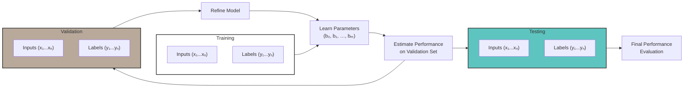

# M2: Basics of Model Learning

**How does a model actually learn? What is learning?**

## Logistic regression as Running Example

How to mathematically define and approach learning in deep neural networks, focusing on parameter optimization to improve prediction accuracy?

- Defining the Learning Problem

    - The goal is to learn model parameters that best predict outcomes from input features using training data.
    - Learning is framed as finding parameters that minimize prediction errors efficiently given computational constraints.

- Empirical Risk Minimization and Loss Functions

    - Performance is measured by a loss function that penalizes poor predictions and rewards accurate ones.
    - The average loss over all training examples is minimized to find optimal parameters, a process called Empirical Risk Minimization.

- Logistic Loss for Binary Classification

    - For binary problems, the logistic loss (negative log-likelihood) quantifies prediction error, penalizing overconfidence in wrong predictions.
    - Minimizing this logistic loss leads to parameters that balance accuracy and confidence, forming the basis for optimization algorithms to learn the model.

**How do we evaluate our netrworks?**

Evaluating the model is necessary to check whether the models generalize well to real-world data.

- Model Complexity and Overfitting

    - Increasing model complexity, such as moving from logistic regression to deep neural networks, allows capturing more complex relationships in data.
    - **Overfitting** occurs when a model fits the training data too closely, capturing noise rather than true patterns, leading to *poor performance on new data.*

- Validation Strategies

    - The gold standard for evaluation is testing the model on new, real-world data not used during training.
    - Since collecting new data is costly, existing data is split into **training, validation, and test sets** to simulate this process.

> - Data Splitting and Usage

    - Training set: used to learn model parameters.
    - Validation set: used repeatedly to tune model architecture and select the best model without fitting parameters.
    - Test set: used only once after model selection to estimate final real-world performance, ensuring unbiased evaluation.

> The "gold standard" validation strategy is trying the model on a new real-world data.

> The loss function is defined as negative log-likelihood

## Gradient descent: Learning a network through optimization

- Optimization Problem Setup

    - The goal is to find model parameters that minimize the average loss over all training data.
    - This is mathematically expressed as minimizing a loss function with respect to the parameters.

-  Gradient Descent Intuition and Visualization

    - Gradient descent is an iterative algorithm that moves parameters step-by-step toward the minimum of the loss function.
    - At each step, the *slope* (*gradient*) of the function at the current parameter value is calculated to determine the direction to move.
    - Moving opposite to the slope leads downhill toward the minimum, and repeating this process gradually approaches the optimal parameters.

- Mathematical Description of Gradient Descent

    - Starting from an initial parameter value, updates are made by subtracting a step size multiplied by the gradient.
    - The gradient generalizes the slope to multiple dimensions, guiding the update direction.
    - The step size controls how far to move in each iteration, and the process repeats until convergence.
    - Run Procedure  

      - Calculate slope at current point.  
          One parameter = derivative  
          Multiple parameters = ∇f(bᵏ)  

      - Move in the direction of negative gradient with step size αᵏ  

      - Run update *bᵏ⁺¹ ← bᵏ − αᵏ ∇f(bᵏ)*。

**Handling Big Data**

*How to efficiently optimize machine learning models on large datasets using Stochastic Gradient Descent (SGD).*

- Challenges with Gradient Descent

    - Gradient Descent requires computing the gradient over the entire dataset, which becomes computationally expensive to compute the gradient of every single data point within big data.
    - For datasets with millions or billions of examples, calculating the full gradient for each update is not scalable.

- **Stochastic Gradient Descent Approach**

    - SGD approximates the gradient by using a *randomly selected single data point* instead of the full dataset.
    - This approximation allows for much faster updates—potentially millions of times faster on large datasets.
    - Although SGD updates are *noisier and sometimes move in the wrong direction*, on average they move toward the *optimum*.

- Why SGD Works and Practical Considerations

    - Data redundancy means a small random sample can provide a good gradient estimate.
    - The expected value of the SGD gradient estimate equals the true gradient, ensuring convergence in expectation.
    - In practice, mini-batches (small groups of data points) are often used to reduce variance while *maintaining speed*.
    - SGD enables scaling optimization to very large datasets because update time does not increase with dataset size.

> Math Equations!

- Main equation: average loss gradient

    $$
    \nabla \left( \frac{1}{N} \sum_{i=1}^{N} \ell(y_i, \sigma(z_i)) \right)
    = \frac{1}{N} \sum_{i=1}^{N} \nabla \ell(y_i, \sigma(z_i))
    $$

- What the symbols mean

  - `N` = number of training examples
  - `y_i` = label of example `i`
  - `z_i` = score for example `i`
  - `σ(z_i)` = sigmoid of the score `z_i`
  - `ℓ(y_i, σ(z_i))` = loss for example `i`
  - `∇` = gradient with respect to the model parameters

- Meaning of the equation

    The left side says:

    - first average the losses over all examples,
    - then take the gradient.

    The right side says:

    - first take the gradient of each example’s loss,
    - then average those gradients.

    These are equal because differentiation is linear.

- Why this works

    `∇(a + b) = ∇a + ∇b`

    `∇(c f) = c ∇f`

    for a constant `c`.

    So the gradient moves through the sum, and the factor `1/N` stays outside.

- Stochastic gradient expectation

    The second equation says that if one index is chosen uniformly at random, then the expected per-example gradient equals the full average gradient.

    $$
    \mathbb{E}_{j \sim \mathrm{Unif}(1,\ldots,N)}\big[\nabla f_j(b)\big]
    = \frac{1}{N} \sum_{i=1}^{N} \nabla f_i(b)
    $$

- What the symbols mean

  - `j ∼ Unif(1, ..., N)` = choose index `j` uniformly from `{1, ..., N}`
  - `f_i(b)` = objective contribution from example `i` as a function of parameter `b`
  - `∇f_i(b)` = gradient of the `i`-th objective contribution
  - `𝔼[...]` = expectation over the random choice of `j`

  This says:

    - sample one example index at random,
    - compute that example’s gradient,
    - average over many such random draws,
    - and you recover the full average gradient.

- Why this matters for SGD

    This is the basic reason stochastic gradient descent works.

    Instead of computing

    $$
    \frac{1}{N} \sum_{i=1}^{N} \nabla f_i(b)
    $$

    using all examples at every step, SGD uses one randomly chosen example or a mini-batch.

    The sampled gradient is an unbiased estimate of the full gradient.

- Connection between the equations

    - The first equation gives the exact full gradient of the average objective.
    - The second equation says that a random per-example gradient has expectation equal to that full gradient.
    - So SGD follows the same objective as full gradient descent, but with cheaper approximate steps.

> Why can't we just set. the loss gradient to 0 and find the parameter
    > For simple models (like linear regression), you can solve gradient = 0 in closed form, but those are rare.
    > For realistic losses (logistic regression, neural nets), `∇L(θ)=0` is a huge non‑linear system with no closed‑form solution.
    > Solving that system directly would be insanely expensive in high dimensions.
    > Stationary points with gradient = 0 include minima, maxima, and saddles; solving it doesn’t tell you which one you get.
    > Gradient descent/SGD is an efficient iterative way to approximate a good minimum without solving the system exactly. 

**Early Stopping**

*Combining validation with our optimization algorithm through early stopping technique! (stop when validation loss stops improving.)*

- **Early Stopping Concept**

    - Early stopping involves monitoring validation loss during the training process to decide when to stop optimization.
    - The goal is to stop training when validation loss stops improving, rather than when training loss reaches its minimum.

- Optimization vs. Generalization

    - Stochastic Gradient Descent (SGD) optimizes training loss, which may not align with maximizing real-world performance.
    - Over-optimizing on training data can lead to overfitting, causing validation performance to degrade.

- Benefits of Early Stopping

    - Saves computational resources by avoiding unnecessary training iterations.
    - Helps achieve better generalization performance by preventing overfitting to the training dataset.

## Assignments: Model Learning with PyTorch

# Lab 2: [Logistic Regression in PyTorch](https://www.coursera.org/learn/machine-learning-duke/ungradedLab/IP4b8/logistic-regression/lab?path=%2Fnotebooks%2F2A_Logistic_Regression.ipynb)

---

> *Introduction to Machine Learning, Module 1, Duke University, Coursera*

