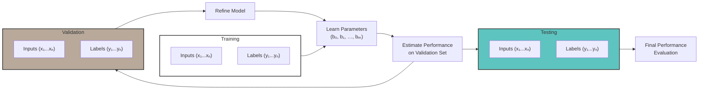

# M2: Basics of Model Learning

**How does a model actually learn? What is learning?**

## Logistic regression as Running Example

How to mathematically define and approach learning in deep neural networks, focusing on parameter optimization to improve prediction accuracy?

- Defining the Learning Problem

    - The goal is to learn model parameters that best predict outcomes from input features using training data.
    - Learning is framed as finding parameters that minimize prediction errors efficiently given computational constraints.

- Empirical Risk Minimization and Loss Functions

    - Performance is measured by a loss function that penalizes poor predictions and rewards accurate ones.
    - The average loss over all training examples is minimized to find optimal parameters, a process called Empirical Risk Minimization.

- Logistic Loss for Binary Classification

    - For binary problems, the logistic loss (negative log-likelihood) quantifies prediction error, penalizing overconfidence in wrong predictions.
    - Minimizing this logistic loss leads to parameters that balance accuracy and confidence, forming the basis for optimization algorithms to learn the model.

**How do we evaluate our networks?**

Evaluating the model is necessary to check whether the model generalizes well to real-world data.

- Model Complexity and Overfitting

    - Increasing model complexity, such as moving from logistic regression to deep neural networks, allows capturing more complex relationships in data.
    - **Overfitting** occurs when a model fits the training data too closely, capturing noise rather than true patterns, leading to *poor performance on new data.*

- Validation Strategies

    - The gold standard for evaluation is testing the model on new, real-world data not used during training.
    - Since collecting new data is costly, existing data is split into **training, validation, and test sets** to simulate this process.

> - Data Splitting and Usage

    - Training set: used to learn model parameters.
    - Validation set: used repeatedly to tune model architecture and select the best model without fitting parameters.
    - Test set: used only once after model selection to estimate final real-world performance, ensuring unbiased evaluation.

> The "gold standard" validation strategy is trying the model on a new real-world data.

> The loss function is defined as negative log-likelihood

## Gradient descent: Learning a network through optimization

- Optimization Problem Setup

    - The goal is to find model parameters that minimize the average loss over all training data.
    - This is mathematically expressed as minimizing a loss function with respect to the parameters.

-  Gradient Descent Intuition and Visualization

    - Gradient descent is an iterative algorithm that moves parameters step-by-step toward the minimum of the loss function.
    - At each step, the slope (gradient) of the function at the current parameter value is calculated to determine the direction to move.
    - Moving opposite to the slope leads downhill toward the minimum, and repeating this process gradually approaches the optimal parameters.

- Mathematical Description of Gradient Descent

    - Starting from an initial parameter value, updates are made by subtracting a step size multiplied by the gradient.
    - The gradient generalizes the slope to multiple dimensions, guiding the update direction.
    - The step size controls how far to move in each iteration, and the process repeats until convergence.

## Assignments: Model Learning with PyTorch

